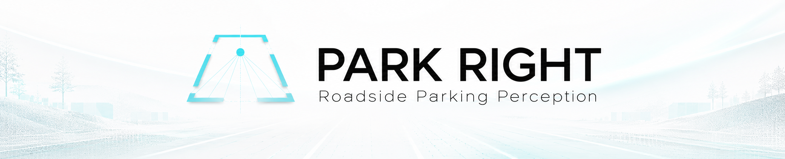
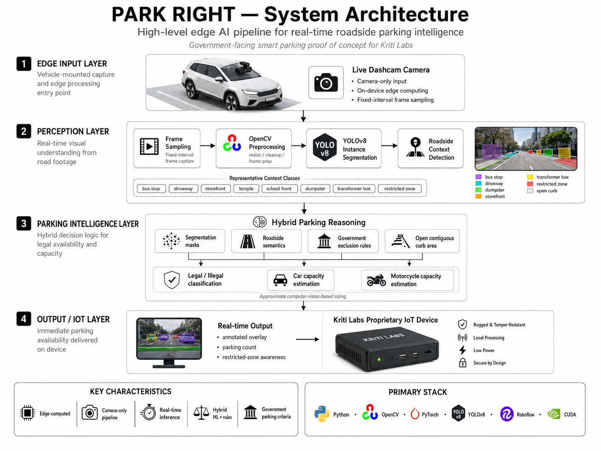
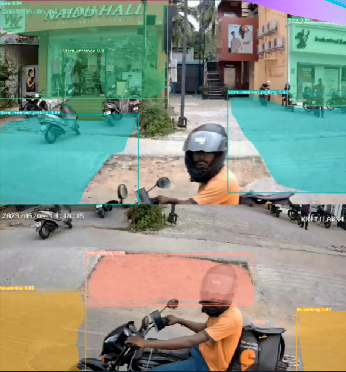
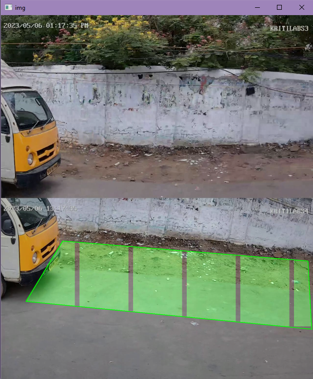

<p align="center">
  
</p>

<h1 align="center">PARK RIGHT — Real-Time Roadside Parking Intelligence</h1>

<p align="center">
  <strong>INSTANCE SEGMENTATION · SPATIAL REASONING · SMART-CITY IOT</strong>
</p>

<p align="center">
  Park Right analyzes live dashcam video to identify legal but unmarked roadside parking,
  segment available space, estimate vehicle capacity, and flag restricted zones in real time.
</p>

<p align="center">
  
  
  
  
</p>

> **Government-facing proof of concept**
>
> Built for Kriti Labs, an IoT company developing smart-city infrastructure. The prototype supported a Chennai government proposal that was approved and led to Kriti Labs securing the implementation contract.

---

## AT A GLANCE

<p align="center">
  
  
  
  
</p>

- Detects legal and restricted roadside parking areas from live dashcam footage.
- Segments irregular available-space boundaries using polygon masks.
- Estimates parking capacity for cars and motorcycles.
- Combines learned segmentation with rule-based government exclusion criteria.
- Produces live overlays, legality labels, and available-space counts.

---

## TECHNOLOGY STACK

<p align="center">
  
</p>

<p align="center">
  
  
  
  
</p>

| Layer | Technologies |
|---|---|
| Video processing | Python, OpenCV |
| Model | YOLOv8 instance segmentation, PyTorch |
| Dataset | Roboflow, polygon annotations, augmentation |
| Training | Google Cloud Platform, CUDA |
| Decision logic | Spatial rules, exclusion zones, capacity estimation |
| Output | Real-time masks, counts, legal/illegal parking labels |

---

## THE PROBLEM

Many Indian roads contain legal roadside parking without painted bays or standardized markings.

Drivers must infer whether parking is allowed by interpreting surrounding context such as:

- Bus stops
- Driveways and entrances
- Schools and temples
- Storefront access
- Utility infrastructure
- Dumpsters and roadside obstacles
- Damaged road sections
- Dedicated or restricted parking zones

Traditional parking systems generally assume marked spaces, fixed cameras, or purpose-built parking lots. That assumption breaks down in dense urban streets where legal availability depends on both open road area and surrounding context.

---

## THE SOLUTION

Park Right combines real-time instance segmentation with spatial and rule-based reasoning.

```text
Live Dashcam Video
        ↓
Frame Capture and Preprocessing
        ↓
YOLOv8 Instance Segmentation
        ↓
Road Context + Restriction Detection
        ↓
Open Roadside Area Analysis
        ↓
Government Exclusion Rules
        ↓
Legal / Illegal Space Classification
        ↓
Vehicle Capacity Estimation
        ↓
Live Masks, Labels and Parking Counts
```

The system does not treat every empty roadside region as valid parking. It first detects surrounding objects and contextual restrictions, then evaluates the remaining space against parking rules.

---

## SYSTEM ARCHITECTURE

<p align="center">
  
</p>

> Architecture image placeholder: `media/architecture.png`

The architecture should show four high-level layers:

### 1. Edge input

- Live dashcam stream
- Vehicle location and road context
- Frame sampling and resizing

### 2. Perception

- YOLOv8 instance segmentation
- Roadside-object detection
- Empty-area segmentation
- Mask confidence filtering

### 3. Parking intelligence

- Government exclusion rules
- Legal vs. illegal classification
- Spatial boundary analysis
- Car and motorcycle capacity estimation

### 4. IoT output

- Live overlays
- Parking availability count
- Restricted-zone warnings
- Data passed to the Kriti Labs IoT device

---

## CUSTOM SEGMENTATION DATASET

I created and labeled a custom dataset containing more than **1,000 road images** across approximately **17 urban context classes**.

Representative classes included:

- Bus stops
- Driveways
- Storefronts
- School entrances
- Temples
- Dumpsters
- Stop signs
- Electricity transformer boxes
- Road entrances
- Dedicated parking zones
- Restricted roadside regions

Polygon annotations were used instead of ordinary bounding boxes because parking boundaries and roadside obstacles are irregular.

The dataset was cleaned, augmented, and divided using a **70/30 train-validation split**.

---

## PARKING-SPACE REASONING

The model output was combined with surrounding metadata and deterministic parking rules.

A roadside region was evaluated using:

- Detected restriction objects
- Empty contiguous road area
- Distance from entrances and driveways
- Available curb length
- Road-edge geometry
- Vehicle dimensions
- Government-provided exclusion criteria

### Representative decision flow

```python
from dataclasses import dataclass


@dataclass(frozen=True)
class ParkingRegion:
    """Describes one candidate roadside region."""

    width_m: float
    blocked: bool
    restricted_context: bool


def estimate_capacity(
    region: ParkingRegion,
    vehicle_width_m: float,
) -> int:
    """Returns legal capacity for one roadside region."""
    if region.blocked or region.restricted_context:
        return 0

    return max(int(region.width_m // vehicle_width_m), 0)
```

> Simplified portfolio example. Production logic also used segmentation masks, spatial relationships, road context, and government exclusion criteria.

---

## SAMPLE OUTPUTS

### Parking-space identification

<p align="center">
  
</p>

### Motorcycle-space segmentation

<p align="center">
  
</p>

---

## IOT DEVICE CONCEPT

<p align="center">
  
</p>

> Product-render placeholder: `media/iot-device.png`

The production concept places the computer-vision pipeline inside a connected roadside or vehicle-mounted IoT device capable of processing live video and reporting parking availability to the broader traffic-management system.

---

## KEY ENGINEERING DECISIONS

| Decision | Why it mattered |
|---|---|
| Instance segmentation | Captured irregular parking boundaries more accurately than bounding boxes |
| Custom local dataset | Reflected Chennai road layouts and restriction contexts absent from generic datasets |
| Hybrid ML and rules | Prevented empty space from being incorrectly classified as legal parking |
| Live dashcam input | Supported mobile road scanning without requiring fixed roadside cameras |
| Polygon annotations | Improved representation of entrances, obstacles, and usable curb space |
| Vehicle-specific capacity | Allowed the same region to be evaluated differently for cars and motorcycles |
| Edge-oriented design | Supported eventual deployment inside Kriti Labs’ IoT hardware |

---

## ENGINEERING OUTCOMES

| Area | Result |
|---|---:|
| Custom dataset | **1,000+ images** |
| Road-context taxonomy | **Approximately 17 classes** |
| Model type | **YOLOv8 instance segmentation** |
| Annotation type | **Polygon masks** |
| Train-validation split | **70 / 30** |
| Input | **Live dashcam video** |
| Output | **Masks, legality labels, counts and capacity estimates** |
| Development role | **Solo computer-vision engineer** |
| Business result | **Government proposal approved** |
| Next stage | **Kriti Labs IoT-device development** |

No benchmark figures are published here because the original evaluation records are not currently available.

---

## MY CONTRIBUTION

### Computer vision

- Owned the complete software and computer-vision proof of concept.
- Fine-tuned the YOLOv8 instance-segmentation model.
- Built the live Python/OpenCV video-inference pipeline.
- Developed segmentation overlays and parking-count outputs.

### Dataset engineering

- Created and cleaned a custom dataset of 1,000+ images.
- Defined approximately 17 Chennai road-context classes.
- Produced polygon-based annotations for irregular boundaries.
- Applied preprocessing, augmentation, and error analysis.

### Parking intelligence

- Implemented legal and illegal parking classification.
- Encoded government-provided exclusion criteria.
- Built car and motorcycle capacity-estimation logic.
- Combined model detections with surrounding spatial context.

### Product delivery

- Produced the government-facing demonstration.
- Supported Kriti Labs’ smart-parking proposal.
- Defined the software workflow intended for deployment on the company’s IoT hardware.

---

## LIMITATIONS

- Performance depends on camera angle, weather, traffic density, and lighting.
- Occluded curbs and crowded road edges remain difficult.
- Local parking rules may require city-specific configuration.
- Production deployment requires additional benchmarking and edge-hardware optimization.
- Formal model metrics are not included because the original evaluation records are unavailable.

---

## PROJECT STATUS

<p>
  
  
  
  
</p>

> **Proof of concept approved.**
>
> Park Right supported Kriti Labs’ successful government proposal. The company secured the smart-parking implementation contract, and the production IoT device integrating this software is under development.
